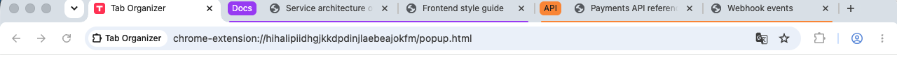
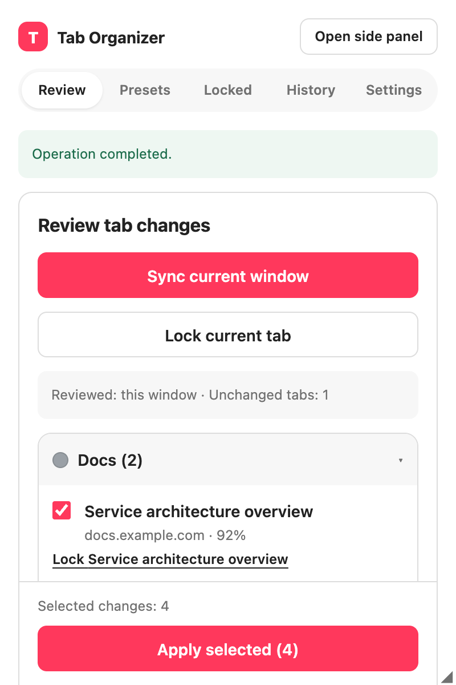
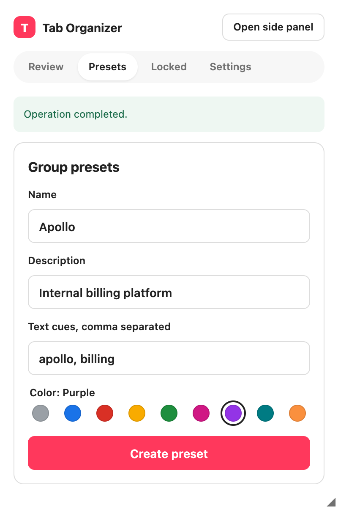
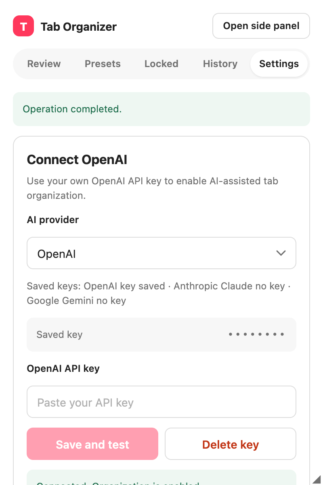

# Tab Organizer

A Chrome extension that sorts your open tabs into Chrome tab groups using an AI model you bring the key for. It supports OpenAI, Anthropic Claude, and Google Gemini, plus any OpenAI-compatible gateway. English, Korean, and Japanese.

Nothing is grouped without your approval: every run produces a list of proposed moves that you review, edit, and apply.



The groups above are real: the extension grouped those tabs through Chrome's own grouping API. Only the pages behind them are stand-ins.

| Review | Presets | Settings |
| --- | --- | --- |
|  |  |  |

## What it does

- **Review before anything moves.** Sync the window you are in, then approve or reject each proposed group, deselect individual tabs, or lock a tab so it is never touched.
- **Organizes new tabs once.** The first real page a new tab lands on can be grouped automatically. Later navigation in that tab is left alone.
- **Presets** teach it names it could not guess — internal project codes, product names — with optional text cues that match locally, before any request is made.
- **Undo.** The ten most recent operations can be reversed for tabs that are still where the extension put them. Your later manual changes are preserved.
- **Split View safety.** A Split View pair that belongs to no group is shown in the review and left alone. Measured on Chrome 140: a pair *inside* a group is not recognized as split, so those two tabs can be moved into different groups and the split ends. Sorting keeps recognized pairs together.
- **Sends very little.** Tab titles, hostnames, existing group names, and preset descriptions. Never full URLs, page content, screenshots, cookies, forms, or history. The URL path is sent only if you turn that on, and the query string never is.

## Install

There is no Chrome Web Store listing yet, so install the packaged build by hand.

1. Download `tab-organizer.zip` from the [latest release](https://github.com/narashin/tab-organizer/releases) and unzip it.
2. Open `chrome://extensions` and turn on **Developer mode** (top right).
3. Click **Load unpacked** and select the unzipped folder — the one containing `manifest.json`.
4. Pin the extension so the toolbar icon stays visible.

Chrome 116 or newer is required. Split View handling applies from Chrome 140 on, with the limit noted above.

Updating means downloading the newer zip and pressing **Reload** on the extension card. Loading an unpacked extension makes Chrome show a "Disable developer mode extensions" warning on startup; that is Chrome talking about the install method, not about this extension.

## Set it up

Clicking the toolbar icon opens the popup. Drag its bottom-right corner to widen it, double-click that corner to reset the width, or choose **Open side panel** for a panel that stays open while you browse.

In **Settings**:

1. Pick an **AI provider**.
2. Paste an API key for that provider. Chrome asks for permission to reach the provider's host the first time; the key is not saved if you decline.
3. Leave the default model or type another one. Defaults are `gpt-5.6` (OpenAI), `claude-opus-5` (Anthropic), and `gemini-3.5-flash` (Google).
4. Optionally set **Grouping breadth** — broad means fewer, larger groups — and decide whether new tabs are organized automatically.

Each provider keeps its own key, model, and endpoint, so switching between them never asks you to paste a key again.

Where to get a key: [OpenAI](https://platform.openai.com/api-keys), [Anthropic](https://console.anthropic.com/settings/keys), [Google AI Studio](https://aistudio.google.com/apikey). Create a dedicated key with a spending limit — a browser extension cannot keep a key as safely as a server can, and a key you can revoke on its own is worth the extra minute.

To use a gateway instead of a provider's own endpoint, set **API base URL**. It must be `https`, except on `localhost` and `127.0.0.1`. Saving a different endpoint clears the previous validation result, so test the key again afterwards.

## Using it

1. Open **Review** and press **Sync current window**. A Chrome tab group belongs to one window, so each window is organized on its own.
2. Each proposed group appears as a row you can expand. Reject a whole group, uncheck single tabs, or lock a tab to keep it out of this and every later run.
3. Press **Apply selected**. Right before moving anything, the extension rechecks each tab's window, URL, title, and current group, and skips whatever changed while you were reading.
4. **History** lists recent operations with an undo button.

If your tabs come back split too finely, widen **Grouping breadth**. If a group keeps getting a name you dislike, add a preset with the name you want.

## Privacy

Your key is stored only in this browser's extension-local storage, is never written to Chrome Sync or to logs, and is never shown back to the interface. Requests go to the provider you picked, or to the gateway address you typed — nowhere else. Locked and incognito tabs are dropped before a request is built.

## Development

```bash
npm install
npm run build     # writes dist/
npm test          # unit and integration tests
npm run lint      # typecheck plus repository rules
npm run test:e2e  # loads dist/ in a fresh Chromium, mocked providers, no real key
npm run package   # builds and writes tab-organizer.zip
npm run screenshots  # rebuilds the interface images from the built extension, all data mocked
npm run screenshots:tab-strip  # regroups real tabs and captures the tab strip (macOS only)
```

Load the absolute `dist/` directory with **Load unpacked** to run a development build. `npm run test:e2e` covers BYOK states, three locales, preset persistence, real Chrome group mutation and undo, and a 101-tab run across windows.

Architecture notes and the rules this codebase follows live in [AGENTS.md](AGENTS.md).

## Permissions

| Permission | Why |
| --- | --- |
| `sidePanel` | the panel version of the interface |
| `storage` | settings, presets, history, and session state |
| `tabs` | tab metadata, grouping, and undo |
| `tabGroups` | group titles, colors, and window-scoped metadata |
| `https://api.openai.com/*` | validating a key and classifying tabs |
| optional hosts | nothing is granted at install time. Access to one specific origin is requested when you save a key for another provider or a custom endpoint |
